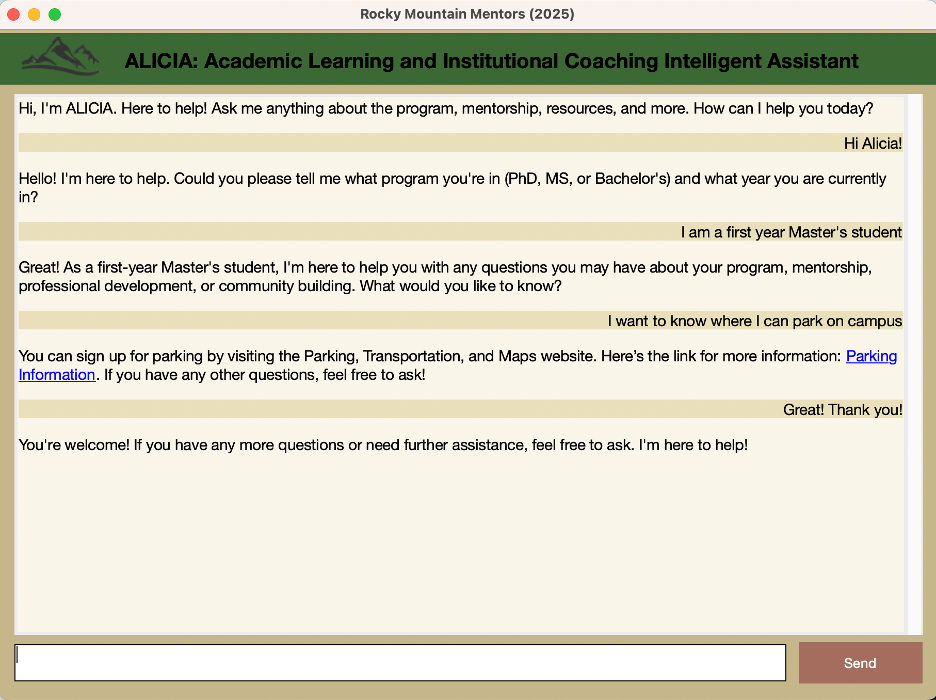

# Rocky Mountain Mentors: **ALICIA**

Academic Learning and Institutional Coaching Intelligent Assistant (ALICIA) is a Retrieval‑Augmented Generation (RAG)‑powered chatbot designed to help students quickly locate policies, schedules, and other institutional knowledge.



---

## Features

* **Retrieval‑Augmented Generation (RAG)** – combines OpenAI models with a curated institutional corpus for accurate, context‑aware answers.
* **Conversational interface** – launch as a local web chat or in a Jupyter Notebook.
* **Extensible knowledge base** – add PDFs, web pages, and text files without retraining.
* **Reproducible Python 3.11 environment** – managed entirely with Conda.

---

## Prerequisites

| Requirement      | Version                       |
| ---------------- | ----------------------------- |
| Operating System | macOS / Linux<sup>†</sup>     |
| Python           | **3.11.13**                   |
| Conda            | *miniconda* or *Anaconda*     |
| OpenAI account   | API key with sufficient quota |

<sup>†</sup> Windows users can follow the Linux commands under WSL or translate them to PowerShell equivalents.

Create a file named `.env` at the project root and add your OpenAI credentials:

```env
OPENAI_API_KEY=<your‑key‑here>
```

---

## Quick Start

```bash
# 1 ▸ Clone repository
$ git clone https://github.com/RockyMountainMentors/ALICIA_GPT_Model.git
$ cd ALICIA_GPT_Model

# 2 ▸ Build and activate environment
$ chmod +x environment_builder.sh
$ ./environment_builder.sh
$ conda activate rmm-llm

# 3 ▸ Launch ALICIA
$ python ALICIA.py                # command‑line interface
# ── or ──
$ code ALICIA.ipynb                # open notebook in VS Code / Jupyter
```

On first launch, the script builds an embeddings index and starts the chat UI at `http://localhost:8000`.

---

## Repository Layout

```
ALICIA_GPT_Model/
├── ALICIA.py
├── ALICIA.ipynb
├── environment_builder.sh
├── data/
│   ├── images/
│   │   └── chatbox.png
│   └── rmm_corpus/
│       ├── agent_description.txt
│       └── resources.txt
└── …
```

---

## Customisation

| File                                    | Purpose                                         |
| --------------------------------------- | ----------------------------------------------- |
| `data/rmm_corpus/agent_description.txt` | Defines ALICIA’s persona and default tone.      |
| `data/rmm_corpus/resources.txt`         | Source documents that the RAG pipeline indexes. |

After updating `ALICIA/.env`, run:

```bash
python ALICIA.py
```

to regenerate embeddings and include new content in future answers.

---

## Contributing

### New to Git & GitHub?

If you're more comfortable using the web interface, click the **Edit** button on any file—GitHub will fork the repo automatically and guide you through submitting a Pull Request (PR).

For a command‑line workflow:

1. **Fork** this repository to your GitHub account.
2. **Clone** your fork locally:

```bash
git clone https://github.com/<your‑username>/ALICIA_GPT_Model.git
cd ALICIA_GPT_Model
```

3. *(Optional)* create a feature branch:

```bash
git checkout -b feature/my-improvement
```

4. **Make your changes**—common edits are in `data/rmm_corpus/resources.txt` or `agent_description.txt`.

```bash
git add resources.txt agent_description.txt
git commit -m "Brief description of change"
```

5. **Push** the branch and open a PR:

```bash
git push --set-upstream origin feature/my-improvement
```

Helpful guides:

* Cloning a repository: [https://docs.github.com/en/repositories/creating-and-managing-repositories/cloning-a-repository](https://docs.github.com/en/repositories/creating-and-managing-repositories/cloning-a-repository)
* Creating a pull request: [https://docs.github.com/en/pull-requests/collaborating-with-pull-requests/proposing-changes-to-your-work-with-pull-requests/creating-a-pull-request](https://docs.github.com/en/pull-requests/collaborating-with-pull-requests/proposing-changes-to-your-work-with-pull-requests/creating-a-pull-request)

We review PRs promptly—feel free to ask questions in your PR description.

---

## Troubleshooting

| Symptom                         | Likely Cause                 | Fix                                        |
| ------------------------------- | ---------------------------- | ------------------------------------------ |
| `ModuleNotFoundError` on import | Environment not active       | `conda activate rmm-llm`                   |
| Blank responses from ALICIA     | Invalid or exhausted API key | Verify `.env` and OpenAI usage limits      |
| `ValueError: API key not set`   | Missing `.env` file          | Ensure the file exists at the project root |

---

## License

Distributed under the **BSD 3-Clause License**. See `LICENSE` for details.

---

## Citation

> Might come later, stay tuned..

---

*© 2025 Rocky Mountain Mentors*
